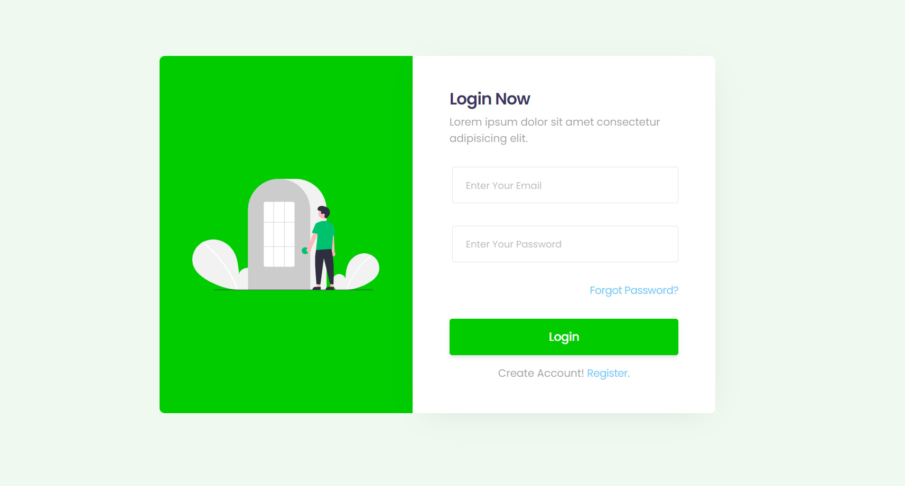
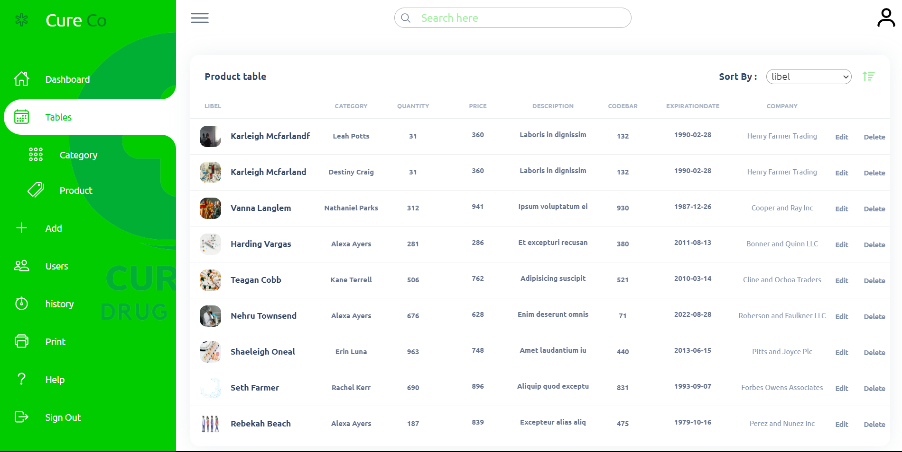
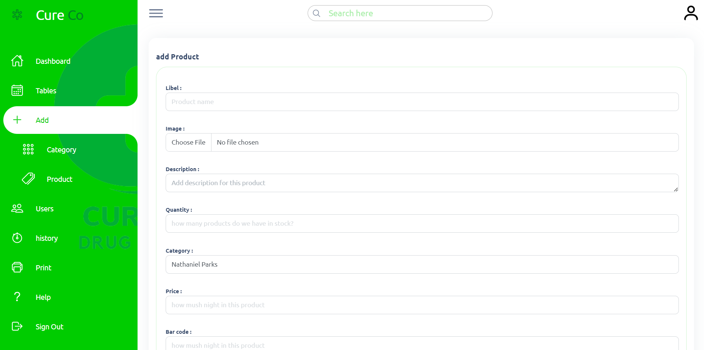

# CureCo

Context of the project
The CureCo company needs your skills as a full stack web developer to create a management dashboard.

The mission will be supervised by your CureCo product owner.

​

Instructions :

​

The application must have an authentication system including at least one role (login as admin).

The application will have to manage authentication (users authenticated as admin will be able to access the backoffice area).

The application must be accessible on different web browsers and different devices.

The application must be secure (SQL injections, use of password hashes).

The application should allow the admin to manage pharmaceutical products (CRUD).

The application should allow the admin to search for pharmaceutical products by name.

The application must allow the addition of several products (at least two) using the JavaScript language.

The application must allow the sorting of pharmaceutical products by order (descending / ascending) of the price and the date of addition.

Pharmacy statistics: total pharmaceutical products present in the application, maximum price.

Field validation with the JavaScript language.

​

Required work :

​

The realization of the UML design (use case diagram, class diagram, sequence diagram).
the realization of the Front-end part (HTML, JS, Bootstrap, Tailwind, ...).
the realization of the Back-end part (PHP POO).

Performance criteria
Validation of forms at the authentication level, CRUD,
Handling with DOM JS.
Implementation of statistics.
Implementation of the Login system/Admin Dashboard.
Have at least two tables.
Implementation of multiple data insertion (two insertions, dynamic form).

